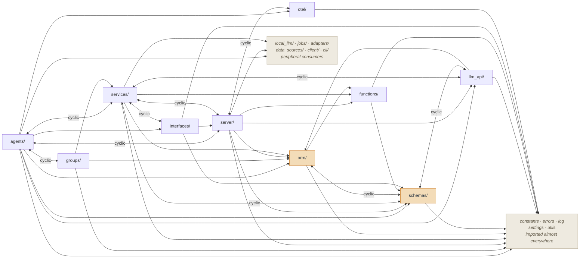
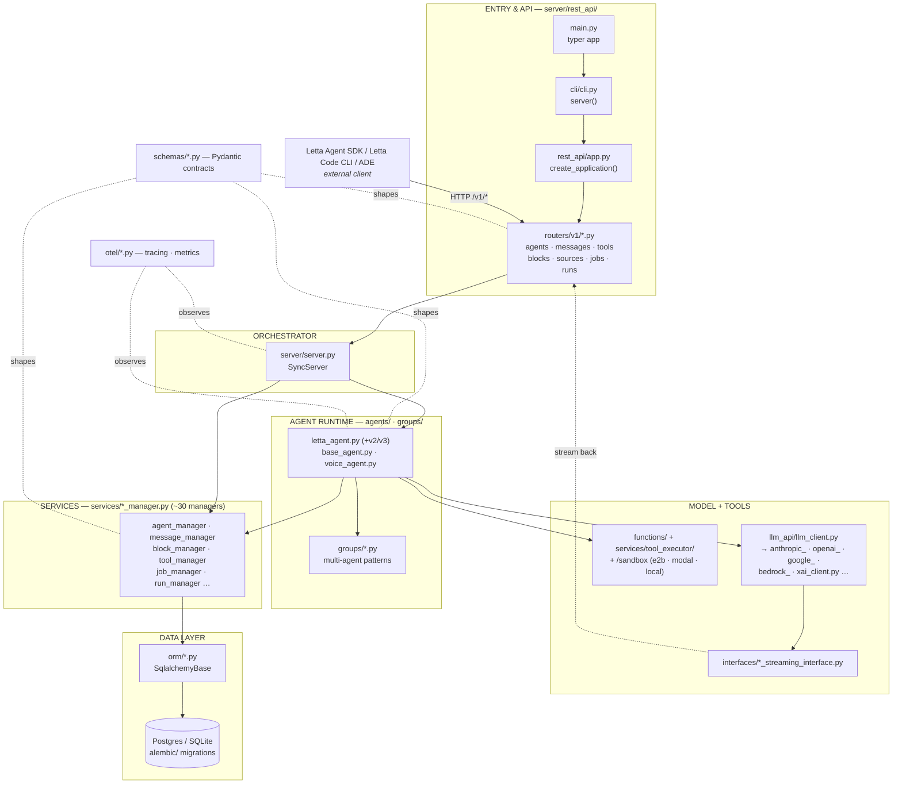
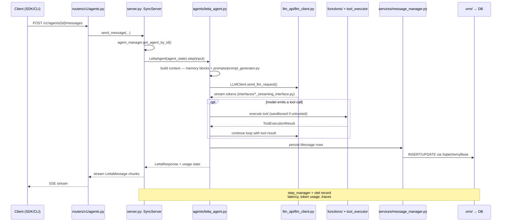

# Letta — System Schematic

A reading guide to the `letta/` server codebase: how a request moves through
the system, and a suggested order to actually read the source.

> **Before you start** — per this repo's own [README.md](README.md) /
> [AGENTS.md](AGENTS.md), this is the **legacy Letta server** behind the V1
> REST API. Active development has moved to the separate `letta-code` repo
> (the Letta Agent SDK / App Server). Read this schematic as "how the
> existing API server is built," not "where new features land."

## Sheet 1 — Code Structure (Import Dependency Graph)

This is the *static* picture — which top-level packages under `letta/`
actually import which others, based on grepping every `from letta.X import`
in the tree. It's messier than the runtime picture in Sheet 2: several core
packages import each other both ways.

**Read the `cyclic` edges as a warning, not a bug report** — this is an
organically-grown codebase, not a strictly layered one. A few worth knowing
about before you go looking for "the" dependency direction:

- **`schemas/` ↔ `services/`** — e.g. `schemas/agent_file.py` imports
  `MessageManager` straight from `services/message_manager.py`.
  `schemas/providers/chatgpt_oauth.py` imports `ProviderManager` *inside a
  function body* instead of at module level — a tell that this exact cycle
  is known and being dodged at import time.
- **`orm/` ↔ `schemas/`** — expected in one direction (ORM rows convert to
  Pydantic), but several `schemas/*.py` files import ORM types back.
- **`server/` ↔ `services/` ↔ `llm_api/` ↔ `interfaces/`** — the runtime
  core in Sheet 2 is also the most mutually-coupled part of the import
  graph; don't expect to import one in isolation for a quick script.

`schemas/`, `orm/`, and the `constants · errors · log · settings · utils`
bundle are the closest things to a stable foundation — nearly everything
depends on them, and they depend on almost nothing back.

## Sheet 2 — System Map

One request enters at the top as HTTP, and by the bottom it's a row in
Postgres. Everything in between is either the **agent runtime** (thinks,
calls tools) or a **service/ORM** pair (persists state). `schemas/` and
`otel/` cut across every layer rather than sitting in the stack.

*Solid = calls / owns, dashed = cross-cutting dependency.*

## Sheet 3 — Request Lifecycle

The sequence below is Sheet 1 unrolled through time, for the single
most-travelled path: a client sends a message to an agent, the agent loops
through the model and its tools, and the result streams back.

The loop inside `opt` repeats until the model stops calling tools, hits
`DEFAULT_MAX_STEPS`, or a heartbeat ends the turn.

## Sheet 4 — Directory Legend

Reference this while reading — it's the same seven layers from Sheet 1,
flattened into one table with the files worth opening first.

| Path | Purpose | Open first |
|---|---|---|
| `agents/` | **[core]** The agent step loop: build context, call the model, run tools, decide when to stop. | `base_agent.py`, `letta_agent.py`, `letta_agent_v3.py`, `voice_agent.py` |
| `groups/` | Multi-agent patterns layered on top of a single agent loop. | `sleeptime_multi_agent_v4.py`, `round_robin_multi_agent.py` |
| `server/rest_api/` | **[core]** FastAPI app assembly, middleware, and the HTTP surface. | `app.py`, `routers/v1/agents.py`, `routers/v1/messages.py` |
| `server/server.py` | **[core]** `SyncServer` — the central orchestrator most routers call into. | `class SyncServer` |
| `services/` | **[core]** Persistence + business-logic façades — one manager per domain object (~30 files). | `agent_manager.py`, `message_manager.py`, `tool_executor/` |
| `orm/` | SQLAlchemy models, one per table. | `sqlalchemy_base.py`, `agent.py`, `message.py` |
| `schemas/` | **[core]** Pydantic contracts — request/response/domain objects shared by every layer above. | `agent.py`, `message.py`, `letta_response.py` |
| `llm_api/` | **[core]** Modern per-provider LLM clients behind one factory interface. | `llm_client.py`, `anthropic_client.py`, `openai_client.py` |
| `local_llm/` | **[legacy]** Self-hosted model backends that predate `llm_api/`. | `llamacpp/`, `ollama/`, `vllm/`, `chat_completion_proxy.py` |
| `functions/` · `/sandbox` | Tool schema generation, MCP client, and sandboxed execution (e2b / modal / local subprocess). | `schema_generator.py`, `mcp_client/`, `modal_executor.py` |
| `interfaces/` | Streaming adapters that turn raw model output into LettaMessage chunks. | `anthropic_streaming_interface.py` |
| `otel/` | Tracing, metrics, and usage/cost telemetry. | `tracing.py`, `metric_registry.py` |
| `helpers/` | Small cross-cutting utilities used by several layers. | `tool_rule_solver.py`, `datetime_helpers.py` |
| `jobs/` | Background polling for async work — batches, scheduled runs. | `scheduler.py`, `llm_batch_job_polling.py` |
| `alembic/` | Database migration history, one file per schema change. | `versions/` |
| `client/` | **[legacy]** Thin legacy Python client remnants. | `streaming.py` |
| `cli/` | Typer CLI commands, incl. loading data into a running server. | `cli.py`, `cli_load.py` |

## Sheet 5 — Reading Order

Follow Sheet 3's path through the actual files, in this order — each stop
only makes sense once the previous one is in your head.

1. **Orientation** — `README.md`, `AGENTS.md`: confirm this is the legacy V1
   server, not the actively developed Agent SDK.
2. **Boot sequence** — `letta/main.py` → `letta/cli/cli.py`: how
   `letta server` turns into a running process.
3. **HTTP surface** — `server/rest_api/app.py`: FastAPI app assembly,
   middleware, and how `routers/v1/*` get mounted.
4. **The two hottest endpoints** — `routers/v1/agents.py`,
   `routers/v1/messages.py`: what a client actually calls.
5. **The orchestrator** — `server/server.py`: `class SyncServer`, the object
   most routers call into.
6. **The agent loop** — `agents/base_agent.py` then `agents/letta_agent.py`:
   context building, the tool-call loop, heartbeats and step limits.
7. **Talking to a model** — `llm_api/llm_client.py` + one concrete client,
   e.g. `anthropic_client.py`: request shaping and streaming.
8. **Running a tool call** — `functions/schema_generator.py`,
   `services/tool_executor/`, top-level `/sandbox`: from tool schema to
   sandboxed execution.
9. **The persistence façade** — `services/agent_manager.py`,
   `services/message_manager.py`: the manager pattern repeated ~30 times
   across `services/`.
10. **The data layer** — `orm/sqlalchemy_base.py`, `orm/agent.py`: ORM
    conventions, then skim `alembic/versions/` for schema history.
11. **The contracts underneath everything** — `schemas/agent.py`,
    `schemas/message.py`: the Pydantic types threaded through every layer
    you just read.

---
*Drawn for reading order, not build order.*
